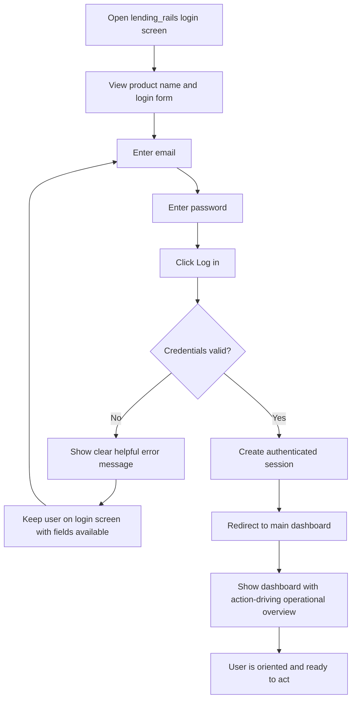

---
stepsCompleted:
  - 1
  - 2
  - 3
  - 4
  - 5
  - 6
  - 7
  - 8
  - 9
  - 10
  - 11
  - 12
  - 13
  - 14
inputDocuments:
  - /Users/rajanavenkatasuryateja/nearform/spike/lending_rails/_bmad-output/planning-artifacts/prd.md
documentCounts:
  productBriefs: 0
  research: 1
  projectDocs: 0
projectName: 'lending_rails'
author: 'RVS'
initializedAt: '2026-03-30 14:03:47 IST'
completedAt: '2026-03-30 15:56:34 IST'
lastStep: 14
workflowCompleted: true
---

# UX Design Specification lending_rails

**Author:** RVS
**Date:** 2026-03-30 14:03:47 IST

---

<!-- UX design content will be appended sequentially through collaborative workflow steps -->

## Executive Summary

### Project Vision

`lending_rails` is an internal lending operations system designed to replace manual coordination and fragmented records with a structured, trustworthy workflow. From a UX perspective, the product should feel like an operational control surface for high-stakes work, helping the admin understand what requires attention now, what state each record is in, what action is valid next, and what information is now locked.

The core experience goal is not simply usability, but operational confidence. The design should reduce anxiety, lower cognitive load, and make correct process execution feel obvious. Investigation and navigation should be fast and lightweight, while irreversible financial actions should feel explicit, deliberate, and safe.

### Target Users

The primary user is a single internal admin operator responsible for running the lending lifecycle end to end. This includes borrower intake, application review, approval or rejection, loan preparation, documentation, disbursement, repayment tracking, and overdue follow-up.

This user needs a desktop-first workspace optimized for repetitive daily operations in a high-consequence environment. They are not looking for exploratory or consumer-style UX. They need clarity, speed, record traceability, and confidence that the system reflects current reality without requiring manual reconciliation.

### Key Design Challenges

The first challenge is making complex operational state understandable at a glance. Applications, review steps, loans, payments, overdue conditions, and locked financial records each have distinct meanings, and the interface must communicate them clearly without overwhelming the user.

The second challenge is balancing speed and caution. The admin needs to move quickly through dashboard views, searches, lists, and detail pages, but the system must also slow the user down at the right moments, especially around disbursement, payment completion, and other financially significant actions.

The third challenge is designing an MPA experience that remains unambiguous across page loads and redirects. Because the product relies on page-based navigation rather than rich real-time client behavior, each screen must stand on its own with explicit status, linked context, and clear next actions.

### Design Opportunities

A major opportunity is to make the dashboard a true command center for daily lending operations, with strong action-first visibility into overdue payments, upcoming repayments, open applications, and active loans. This would help the admin prioritize work immediately and reduce reliance on memory or side tracking.

Another opportunity is to make detail pages exceptionally strong at communicating lifecycle progress, linked records, and action boundaries. Clear stage indicators, history visibility, and obvious edit-lock rules can become a real product advantage in a workflow-heavy financial environment.

A third opportunity is to create a UX rhythm that feels dependable and calming: dashboard signal, filtered list, record inspection, safe action, refreshed state. If executed well, this can turn a stressful operational workflow into one that feels controlled, trustworthy, and efficient.

## Core User Experience

### Defining Experience

The core user experience of `lending_rails` is a controlled daily lending operations workflow built around operational trust. The most frequent user behavior is checking overdue and upcoming payments, using the system to understand what needs attention now and to move directly into the right records for follow-up. This repayment triage loop is the daily heartbeat of the product.

However, the product promise is broader than repayment visibility alone. The system only works as a trusted operating system if the full lending lifecycle feels coherent and dependable, from borrower intake through application review, approval, documentation, disbursement, repayment tracking, overdue handling, and closure. Every major workflow should either drive, support, or protect the admin's trust in the system.

### Platform Strategy

`lending_rails` should be designed as a desktop-first internal web application optimized for mouse-and-keyboard use in the latest version of Chrome. The experience should support long operational sessions with frequent movement between dashboard views, filtered lists, detail pages, and confirmation-based actions.

For MVP, the platform can assume a stable connected environment with no offline requirement. This allows the UX to rely on server-refreshed page loads and explicit state presentation rather than offline synchronization or complex multi-device behavior. The interface should prioritize efficiency, readability, and predictable navigation for a single-admin operating model.

### Effortless Interactions

The experience should make understanding the system feel effortless. Search and lookup should be fast and dependable. Record status should be easy to understand immediately. The next valid action should always feel obvious. Movement from dashboard signal to filtered list to record detail should require minimal thought.

At the same time, the product should distinguish effortless understanding from deliberate commitment. Financially significant actions such as disbursement and payment completion should not feel casual. These actions should feel explicit, well-signposted, and clearly confirmed so the user understands both the consequence and the resulting locked state.

The system should also remove avoidable friction by automatically surfacing what matters, deriving statuses from system facts, and reducing the need for memory or side tracking. Wherever possible, the product should do the interpretive work for the admin, especially around overdue detection, lifecycle visibility, and linked record context.

### Critical Success Moments

The most important recurring success moment happens when the admin opens the product and can immediately understand what repayment work requires attention, especially overdue and upcoming payments. This is where the product proves, again and again, that it can replace manual follow-up and fragmented tracking.

A second critical success moment occurs whenever the admin completes a financially significant action such as disbursement or payment completion. These moments should feel deliberate, explicit, and safe, with strong confirmation and unmistakable post-action state. If these interactions are ambiguous or error-prone, trust in the entire system breaks down.

More broadly, the make-or-break requirement is end-to-end workflow integrity. If any major part of the lifecycle feels unclear, disconnected, or unreliable, the user's confidence in the full operating model is weakened. Trust is cumulative in this product and must be reinforced repeatedly through accurate dashboards, clear statuses, reliable transitions, and obvious record lineage.

### Experience Principles

- Prioritize repayment triage as the daily operational heartbeat of the product.
- Make the full lending lifecycle feel coherent, connected, and trustworthy from start to finish.
- Keep investigation and navigation lightweight, but make financial actions deliberate and clearly confirmed.
- Preserve orientation on every important screen by making it obvious what has happened, what state the record is in, what can happen next, and what is now locked.
- Use consistent status language and clear record lineage across borrower, application, loan, payment, and invoice views.
- Let the system carry operational memory by surfacing derived states, linked context, and action-ready views automatically.

## Desired Emotional Response

### Primary Emotional Goals

The primary emotional goal of `lending_rails` is to make the admin feel safe to act, confident in what they are doing, and certain that the system is representing operational reality correctly. In a high-stakes lending workflow, trust and protection matter more than speed alone. The product should create the sense that the user is operating on solid ground.

Supporting that, the experience should also make the user feel efficient and productive in daily operations, while remaining reassured and safe during money-sensitive workflows. The emotional tone should be grounded, predictable, and confidence-building rather than energetic or playful.

### Emotional Journey Mapping

When the admin first enters the product, they should feel oriented quickly and reassured that the system is showing them what matters now. The dashboard and key operational views should create an immediate sense of clarity and control.

During the core experience, especially repayment triage and workflow progression, the user should feel capable, protected, and supported by the system. The product should reduce hesitation by making statuses legible, next actions obvious, and risk boundaries unmistakable.

After completing an important task, especially a financially significant action, the user should feel relief first, followed by confidence and accomplishment. The interface should visibly close the loop by making it obvious that the task is complete, the new state is recorded, and the system is now in a trustworthy updated condition.

If something is missing, blocked, or potentially risky, the user should feel protected from making a bad move. The product should communicate caution without inducing panic, explain what is preventing progress, and guide the user toward the safest next step.

When returning to the product repeatedly, the user should feel that it is a dependable operational environment they can rely on day after day. Emotional success comes from repeated reinforcement of predictability, safety, and control.

### Micro-Emotions

The most important micro-emotions for `lending_rails` are trust over skepticism, confidence over confusion, and calm over anxiety. These are the emotional foundations of a product intended to support financially significant workflows.

Secondary but still important micro-emotions include accomplishment over frustration and satisfaction over delight. The product does not need to entertain the user. It needs to help them complete work reliably and feel assured that they did it correctly.

The emotional priority order should be:
- trust and safety
- confidence and certainty
- calm and predictability
- accomplishment and productivity
- satisfaction over delight

### Design Implications

To create trust and certainty, the UX should use explicit status language, clear stage progression, and strong visibility into what has happened, what is happening now, and what can happen next.

To create reassurance and safety, financially significant actions should include clear confirmation, visible consequence, and unmistakable locked-state feedback after completion. The user should never feel unsure whether a disbursement or payment completion was recorded correctly.

To create calm, the interface should be structurally predictable. Status language, action placement, and post-action behavior should remain consistent across the product so the user can build confidence through repetition.

To create efficiency and productivity, the interface should reduce lookup friction, surface action-ready work, and make movement across dashboard, lists, and record details feel fast and obvious.

To protect the user from making a bad move, the system should prevent invalid actions, explain why something is blocked, and present safe recovery paths when data is missing or workflow requirements are incomplete.

### Emotional Design Principles

- Design for trust and safety before speed or delight.
- Make predictability a core emotional feature of the product.
- Help the user feel protected from costly mistakes through explicit guidance and constraint.
- Reinforce relief and accomplishment after important actions with clear loop-closing state confirmation.
- Reduce anxiety by making statuses, dependencies, and next steps immediately understandable.
- Let trust build cumulatively through repeated moments of correctness, safety, consistency, and control.

## UX Pattern Analysis & Inspiration

### Inspiring Products Analysis

`Frappe Lending` is the closest domain-adjacent reference. Its strongest value for `lending_rails` is the sense of operational separation: dashboards, records, and workflow areas feel clearly divided rather than blended together. This helps create a clean mental model for admins working across multiple lending tasks and gives the product a domain-shaped structural foundation.

`Stripe Dashboard` is a strong reference for trustworthy financial UX. It handles dense, consequential information with a clear hierarchy, making money-related records feel structured, serious, and dependable rather than intimidating. Its strongest contribution is not visual style, but the way it makes financial information feel credible and well-controlled.

`Linear` is a useful reference for workflow clarity and pace. It is strong at making status, progress, and next action feel immediately understandable. Its list-to-detail rhythm and efficient handling of operational work can inform how `lending_rails` moves users from dashboard signals into focused task execution. However, its influence should be applied to clarity and workflow rhythm, not to sparseness where financial context would be lost.

Together, these products suggest a design direction that is domain-shaped like `Frappe Lending`, trust-shaped like `Stripe`, and flow-shaped like `Linear`. The goal is to borrow structural strengths rather than visual aesthetics.

### Transferable UX Patterns

**Navigation and layout patterns**
- Use a dashboard as a triage surface first, prioritizing urgent and actionable work before summaries.
- Maintain clear visual and structural separation between major work areas such as borrowers, applications, loans, payments, and invoices.
- Make movement from summary signal to filtered list to record detail feel direct, consistent, and predictable.

**Interaction patterns**
- Use strong, explicit status language so users can understand state at a glance.
- Surface action-ready tasks prominently, especially overdue and upcoming payment work.
- Keep investigation lightweight while making financially significant actions more deliberate and confirmation-based.
- Show linked record context clearly so users can trace relationships across borrower, application, loan, payment, and invoice flows.
- Use a consistent interaction grammar across entities so the system feels like one coherent operational product.

**Visual and information patterns**
- Favor high information clarity over decorative complexity.
- Use hierarchy, spacing, and grouping to make dense operational data feel manageable.
- Make important states, warnings, and locked records visually obvious without overwhelming the page.
- Design detail pages to support confidence through record lineage, history visibility, and state clarity.

### Anti-Patterns to Avoid

- Avoid cluttered enterprise-style pages that show too much at once and make the user hunt for what matters.
- Avoid overly minimal layouts that remove important financial or workflow context in the name of cleanliness.
- Avoid dashboards that behave like static KPI boards rather than action-driving triage surfaces.
- Avoid fragmented entity experiences where borrowers, applications, loans, and payments feel like separate mini-products.
- Avoid inconsistent status labels or action placement across entities, since inconsistency weakens trust.
- Avoid casual treatment of money-related actions; disbursement and payment completion should never feel lightweight or ambiguous.

### Design Inspiration Strategy

**What to adopt**
- Adopt the clear work-area separation seen in `Frappe Lending` because it supports operational clarity and domain fit.
- Adopt the trustworthy hierarchy and careful handling of consequential financial information seen in `Stripe Dashboard`.
- Adopt the workflow legibility and status clarity seen in `Linear`, especially for list/detail transitions and task focus.

**What to adapt**
- Adapt Stripe-like financial clarity to a narrower, single-admin lending workflow rather than a broad financial platform.
- Adapt Linear-like workflow sharpness without letting compactness obscure important financial context.
- Adapt Frappe Lending's structural patterns while strengthening state visibility, safety cues, and post-action confirmation for money-critical tasks.

**What to avoid**
- Avoid copying visual style without understanding the interaction logic underneath it.
- Avoid enterprise dashboard bloat where too many modules compete for attention.
- Avoid generic admin UI patterns that treat all records the same instead of respecting financial risk and workflow state.
- Avoid any design choice that weakens orientation, record lineage, or the user's sense of being protected from mistakes.

This inspiration strategy should help `lending_rails` feel calm, trustworthy, and operationally clear while remaining tailored to its own lending workflow and risk profile.

## Design System Foundation

### 1.1 Design System Choice

The recommended design system foundation for `lending_rails` is a themeable utility-first system built around `Tailwind CSS` with `shadcn/ui`-style components. This approach provides a strong balance between implementation speed, visual control, and long-term flexibility for an internal admin product.

This choice is well suited to a desktop-first lending operations tool because it supports the creation of clear, modern, structured interfaces without the overhead of building a custom design system from scratch. Its value is not trendiness, but control: it gives the product a stable component foundation while allowing the team to shape a calm, trustworthy, and operationally precise interface.

It is important to treat this as the foundation, not the finished design system. The actual design system for `lending_rails` will come from the product-specific rules, patterns, and primitives defined on top of this base.

### Rationale for Selection

This system fits the project because the primary goal is not visual uniqueness, but a trustworthy and efficient operational experience. `lending_rails` needs strong support for tables, forms, filters, badges, dialogs, status indicators, and layout composition, while still allowing enough control to create a modern financial interface with clear hierarchy and safe action handling.

A `Tailwind` + `shadcn/ui` foundation supports low-cost customization and lets the product establish a clean visual tone without requiring a full brand system. It also works well for a single-admin MVP because the team can move quickly, use existing component patterns, and apply design decisions consistently across borrower, application, loan, payment, and invoice workflows.

This choice also aligns with the inspiration strategy established earlier. It can support the workflow clarity associated with `Linear`, the structured seriousness associated with `Stripe Dashboard`, and the clear work-area separation seen in `Frappe Lending`, without copying any of them directly.

### Implementation Approach

The implementation approach should use `shadcn/ui` components as the base layer for common interface elements such as buttons, inputs, dialogs, dropdowns, tabs, tables, badges, cards, and alerts. `Tailwind CSS` should be used to define layout structure, spacing rules, state styling, and domain-specific visual patterns that give the product its operational clarity.

The MVP should rely on a small, disciplined component vocabulary rather than a large custom component inventory. Priority components should include:
- dashboard summary cards and triage widgets
- searchable and filterable data tables
- record detail sections with linked entity context
- lifecycle and status badges
- confirmation dialogs for money-sensitive actions
- form layouts for borrower, application, loan, and payment workflows
- warning, blocked-state, and success feedback patterns

Admin-heavy products depend heavily on repeatable table behavior, so the table and filter experience should be treated as a first-class system pattern rather than just another component. Sorting, filtering, empty states, row actions, status cells, and linked record references should follow consistent rules everywhere they appear.

To avoid inconsistency, the team should define a small set of product primitives or standard patterns on top of the base component library. These should include:
- entity headers
- status badges
- filter bars
- data tables
- detail sections
- confirmation dialogs
- activity or timeline blocks
- empty states
- blocked-state callouts

This creates a consistent operational language without requiring a heavy custom design system.

### Customization Strategy

Customization should be intentionally light in MVP. The goal is not to create a highly branded visual identity, but to shape the system into a calm, trustworthy, and readable admin experience. Styling should emphasize clarity, hierarchy, predictable spacing, and clear state communication over decorative differentiation.

The customization strategy should focus on:
- a restrained color palette with strong semantic status colors
- clear typography for dense operational information
- consistent spacing and layout rules across all entity views
- highly legible badges, alerts, and locked-state indicators
- deliberate visual treatment of risky or irreversible actions
- repeatable patterns for list-to-detail workflow transitions

The most important consistency should be behavioral, not cosmetic. The system should make statuses, confirmations, post-action feedback, and layout rhythm feel predictable everywhere. Where custom patterns are introduced, they should solve domain-specific lending needs rather than visual preference alone. The system should stay simple, consistent, and easy to maintain while supporting the product's core emotional and operational goals.

## 2. Core User Experience

### 2.1 Defining Experience

The defining experience of `lending_rails` is helping the admin understand what needs attention now and act on it without second-guessing. This is not limited to one isolated task such as checking repayments or opening a record. It is a combined operational interaction: the system surfaces the right work, makes lifecycle state clear, connects the right records, and guides the admin toward the next safe action.

What makes this experience special is that it replaces memory-based lending operations with structured operational confidence. Instead of relying on recollection, manual follow-up, or fragmented tracking, the admin should feel that the system is carrying the operational burden for them. If this experience is nailed, the rest of the product feels trustworthy.

### 2.2 User Mental Model

Today, the admin largely manages the lending workflow through memory. That means the mental model is not based on a dependable system of record, but on remembering what happened, what still needs to happen, and what is risky to change. This creates stress and makes every operational step feel more fragile than it should.

The user likely thinks in terms of practical questions rather than formal system entities: What needs attention now? Where is this borrower or loan in the process? What happened already? What can I safely do next? The product should align to that mental model by organizing the experience around operational state, next actions, and linked context rather than making the admin mentally reconstruct the workflow.

### 2.3 Success Criteria

The core experience succeeds when the admin can move through daily lending work without hesitation, uncertainty, or dependence on memory.

Success indicators include:
- the admin can immediately identify what requires attention now
- the admin can understand the current state of a borrower, application, loan, or payment at a glance
- the admin can see the next valid action without needing to infer it
- the admin can move across linked records without losing context
- the admin can complete sensitive actions with confidence that the system recorded them correctly
- the admin feels able to act without second-guessing

### 2.4 Novel UX Patterns

The defining experience should mostly rely on established patterns rather than novel interaction design. This is an internal operational tool where clarity and trust are more important than inventing new behaviors. Familiar admin patterns such as dashboards, lists, detail pages, badges, timelines, confirmations, and linked record navigation should remain the foundation.

The product's differentiation should come from how these familiar patterns are combined. The unique value is not a new interaction metaphor, but a more coherent operational flow: action-first dashboard triage, strong lifecycle visibility, linked record context, and deliberate handling of money-sensitive actions. In other words, `lending_rails` should innovate through composition and clarity rather than novelty.

### 2.5 Experience Mechanics

**1. Initiation**

The experience begins when the admin lands on the dashboard or another operational entry point and immediately sees what requires attention. Triage widgets, status summaries, and action-oriented lists invite the user into the right work rather than forcing them to search blindly.

**2. Interaction**

The admin selects the relevant item, moves into a filtered list or directly into a detail view, and reviews the current state. From there, they can inspect linked borrower, application, loan, payment, and invoice context as needed. The system should make the next valid action obvious while keeping invalid or risky actions constrained.

**3. Feedback**

As the admin works, the interface should provide strong feedback through clear statuses, lifecycle indicators, linked history, and confirmation states. The user should always know whether they are progressing correctly. If something is blocked or missing, the system should explain why and show the safest path forward.

**4. Completion**

The experience completes when the admin performs the needed action and sees unmistakable confirmation that the state has updated correctly. The result should feel closed-loop: the task is done, the system reflects the new reality, and the admin can move on confidently to the next item without doubt.

## Visual Design Foundation

### Color System

The visual foundation for `lending_rails` should begin with a light theme designed for clarity, confidence, and long-form operational use. Because the product is a high-stakes internal lending tool, the color system should feel professional and modern without becoming visually loud. The primary goal of color is to support hierarchy, trust, and fast state recognition rather than brand expression.

The core palette should be built around neutral surfaces and structured grays, with a restrained accent color used for primary actions and important highlights. More importantly, the palette should be semantically disciplined. Status and workflow meaning should be communicated through a stable system of colors for states such as active, completed, upcoming, overdue, blocked, locked, and attention-needed.

Semantic colors should do most of the heavy lifting: success for completed or healthy states, warning for upcoming risk or attention-needed states, danger for overdue or blocked conditions, and muted tones for historical or inactive information. The meaning of these colors should remain consistent across all entities and screens.

Dark mode can be supported later, but the initial system should optimize for light-theme readability and consistency first. Any future dark theme should preserve the same semantic structure, contrast rules, and visual hierarchy rather than introducing a different visual philosophy.

### Typography System

The typography system should use a clean sans-serif typeface optimized for high readability in dense admin contexts. The goal is to reduce friction when scanning tables, reviewing lifecycle states, reading forms, and comparing operational details across linked records.

Type hierarchy should be straightforward and functional:
- strong page titles for orientation
- clear section headings for detail pages
- highly legible body text for operational content
- compact but readable table text
- distinct label and metadata styles for statuses, timestamps, and supporting context

Typography should prioritize consistency, readability, and low cognitive load over stylistic personality. Line height, font size, and weight should be tuned for long periods of use, especially in table-heavy and form-heavy views where clarity is more important than visual expressiveness.

### Spacing & Layout Foundation

The layout foundation should be balanced rather than dense or spacious. The interface should feel efficient enough for frequent daily operations, but never cramped. Spacing should help users parse structure quickly, especially when moving between dashboard summaries, filtered lists, and detail views.

The layout model should follow a stable structural grammar:
- dashboard views summarize and triage
- list views support comparison, filtering, and operational scanning
- detail pages explain state, linked context, history, and next actions

This grammar should remain consistent across all major entities so users do not have to re-learn the interface for borrowers, applications, loans, or payments.

A consistent spacing system should be applied across all entity pages so that lists, forms, detail sections, alerts, and confirmations feel part of the same operational environment. The system should create predictable rhythm through repeated layout patterns rather than one-off compositions.

The spacing system should define a small set of repeatable density rules for:
- page shell spacing
- card padding
- section spacing
- form row spacing
- table density tiers

This will help the product feel cohesive even when dashboards, lists, and detail pages have different content needs.

### Accessibility Considerations

Because `lending_rails` supports dense admin work with financial implications, accessibility should prioritize above-average readability and operational safety even without a formal compliance target. Text contrast, status clarity, spacing, and interaction feedback should all support fast, low-error interpretation.

Key accessibility considerations should include:
- strong text-to-background contrast in all operational views
- semantic colors reinforced by text labels or icons, not color alone
- readable font sizes in tables, forms, and detail sections
- clear focus states and interaction feedback for keyboard and mouse users
- confirmation and warning patterns that make risky actions unmistakable
- sufficient visual distinction for locked, blocked, overdue, and completed states

This visual foundation should help the product feel calm, trustworthy, and operationally clear while supporting sustained daily use in a high-consequence environment.

## Design Direction Decision

### Design Directions Explored

Multiple design directions were explored to test different balances of operational clarity, urgency, workflow visibility, and guarded financial interactions. These directions varied in layout structure, dashboard emphasis, visual weight, detail-page treatment, and confirmation style.

The exploration included:
- a balanced operations console direction
- a more urgency-led triage dashboard direction
- a darker, higher-contrast fintech direction
- a record-lineage-heavy detail direction
- a workflow-lane direction for stage-based progression
- a safety-led confirmation direction for irreversible actions

This comparison helped identify which approach best supports the product's core promise of helping the admin act without second-guessing.

### Chosen Direction

The chosen direction for `lending_rails` is **Direction 1: Ops Console**.

This direction should be used as the primary visual and structural foundation for the product. It provides the most balanced combination of calm operational clarity, repeatable admin structure, readable hierarchy, and scalable layout consistency across dashboards, lists, and detail pages.

Direction 1 best supports the product's core experience because it feels trustworthy without becoming heavy, modern without becoming stylized, and structured without becoming cluttered. It is well suited to a system where the admin needs to move frequently between repayment triage, record inspection, and high-consequence actions while maintaining confidence in what the system is showing.

### Design Rationale

Direction 1 was selected because it most closely aligns with the intended emotional and operational character of the product. It supports a calm, professional, and modern lending interface that helps the user stay oriented and productive during daily work.

It also provides a strong system-wide foundation. The left-navigation shell, clear metric hierarchy, and balanced detail structure can scale consistently across borrowers, applications, loans, payments, and invoices without making the product feel fragmented.

Compared with other directions, it avoids the main risks that would weaken the product:
- it is less alert-heavy than the triage-first direction
- less visually dramatic than the darker fintech direction
- less context-heavy than the record-trail-first direction
- less specialized than the workflow-lane direction
- less interaction-specific than the safety-led confirmation direction

This makes it the best default direction for an MVP that needs to feel coherent across the entire lending lifecycle.

### Implementation Approach

Implementation should use Direction 1 as the baseline design language for page shell, navigation, metrics, dashboard cards, data tables, and detail layouts. The overall experience should preserve its balanced visual weight, structured hierarchy, and calm operational tone.

As the system is implemented, patterns for status display, linked-record visibility, confirmation handling, and blocked-state messaging should be expressed within the Direction 1 framework rather than by switching to different visual paradigms for different parts of the app.

This approach will help the product feel like one consistent operational environment rather than a collection of disconnected screens.

## User Journey Flows

### Login to Dashboard Landing

This journey defines the user's first interaction with `lending_rails`. The login experience should feel simple, calm, and trustworthy. It should avoid unnecessary complexity while still establishing that this is a serious internal lending operations system.

The login screen should present the product name clearly, followed by a focused email-and-password form. The screen should feel polished but restrained, with no distracting marketing content or unnecessary visual weight. The goal is to help the admin enter the system quickly and confidently.

On successful login, the user should be taken directly to the main dashboard. The dashboard should immediately reinforce that the system is ready to help with daily lending work by surfacing what matters now, especially repayment-related work and other action-driving operational signals.

If login fails, the system should respond in a clear and helpful way. Error feedback should explain that the credentials were invalid without creating unnecessary alarm or blame. The user should be able to correct the issue and try again without losing orientation.

### Journey Patterns

From this login journey, the main reusable patterns are:

- **Focused entry pattern**
  A screen should present only the information needed for the current task, without unnecessary distractions.

- **Clear feedback pattern**
  When something fails, the system should explain the issue plainly and help the user recover quickly.

- **Immediate orientation pattern**
  After successful entry, the product should land the user in a place that makes current priorities obvious.

### Flow Optimization Principles

- Keep the login flow to the minimum necessary steps.
- Make the form visually calm and highly legible.
- Ensure failed login attempts are recoverable without confusion.
- Use the dashboard landing experience to immediately establish trust and relevance.
- Treat the transition from login to dashboard as the first proof that the system is organized and dependable.

## Component Strategy

### Design System Components

The foundation of the component strategy for `lending_rails` should come from the chosen `Tailwind CSS` + `shadcn/ui` system. This gives the product a reliable base for standard interface elements such as buttons, inputs, selects, dialogs, tables, tabs, cards, alerts, badges, and dropdown menus.

These foundation components should be used wherever standard behavior is sufficient. The product should avoid creating custom components for problems already solved well by the base system. This keeps implementation fast, consistent, and maintainable.

For MVP, the design system should especially rely on foundation components for:
- login form structure
- primary and secondary actions
- standard form controls
- basic cards and panels
- dialogs and alerts
- base tables and row interactions
- tabs and segmented views where needed

### Custom Components

The product should introduce a small set of custom components only where lending workflows require domain-specific meaning, trust, and operational clarity. The goal is not to create a broad custom library, but to define the core product primitives that make the interface feel coherent and trustworthy.

The most important MVP product primitives are:
- shared data table stack
- lifecycle and status system
- entity header / summary block
- guarded confirmation dialog

These components should be treated as the backbone of the experience.

### Lifecycle Status Badge

**Purpose:** Communicate operational state clearly across applications, loans, payments, and related records.  
**Usage:** Used anywhere lifecycle state must be scannable at a glance.  
**Anatomy:** Label, semantic color treatment, optional icon, optional secondary state indicator.  
**States:** Default, warning, danger, success, muted, locked.  
**Variants:** Compact inline version, standard list/detail version.  
**Accessibility:** Status meaning must never rely on color alone; labels remain explicit.  
**Interaction Behavior:** Primarily informational, but may link to filtered views in some contexts.

### Dashboard Triage Widget

**Purpose:** Surface action-driving operational work such as overdue payments, upcoming payments, open applications, and active loans.  
**Usage:** Main dashboard and other high-level summary surfaces.  
**Anatomy:** Title, primary metric, supporting context, urgency cue, clickable drill-in action.  
**States:** Default, attention-needed, warning, empty.  
**Variants:** Metric-first card, compact summary card.  
**Accessibility:** Clear headings, readable metric hierarchy, keyboard-navigable card actions.  
**Interaction Behavior:** Clicking takes the user into a filtered operational list or relevant record set.

This component should not feel isolated from the rest of the product. Its hierarchy, spacing, and language should feel directly connected to the table and detail-page system so the dashboard feels like the start of the workflow, not a separate visual mode.

### Filter Bar

**Purpose:** Standardize how users narrow operational lists quickly and confidently.  
**Usage:** Borrowers, applications, loans, payments, invoices, and dashboard drill-in lists.  
**Anatomy:** Search field, filters, sort controls, optional quick-status chips, reset action.  
**States:** Default, filters applied, empty result, loading.  
**Variants:** Compact table-toolbar version, expanded filter-panel version.  
**Accessibility:** All controls keyboard accessible, filter state clearly announced, reset obvious.  
**Interaction Behavior:** Should update list context predictably and make active filters visible.

### Data Table Wrapper

**Purpose:** Provide one shared table pattern across the product with light variations by entity type.  
**Usage:** All operational list views.  
**Anatomy:** Header, filter bar, sortable columns, status cells, inline metadata, row actions, empty state, pagination if needed.  
**States:** Default, loading, empty, filtered empty, error.  
**Variants:** Payment-heavy table, application/loan table, borrower table.  
**Accessibility:** Proper table semantics, keyboard focus states, readable density, sortable headers announced.  
**Interaction Behavior:** Rows lead into detail views; row actions remain secondary to record opening.

The shared table stack should be more opinionated than a generic table shell. Status cells, metadata formatting, row-click behavior, empty states, and action placement should follow consistent rules so the product does not drift from screen to screen.

### Entity Header / Summary Block

**Purpose:** Give immediate orientation on record detail pages.  
**Usage:** Borrower, application, loan, payment, and invoice detail views.  
**Anatomy:** Record title, primary identifiers, current status, key metadata, top actions.  
**States:** Default, warning, overdue, locked, completed.  
**Variants:** Borrower summary, application summary, loan summary, payment summary.  
**Accessibility:** Hierarchy should make record identity and current state immediately clear.  
**Interaction Behavior:** Acts as the stable anchor for each detail page.

### Linked-Record Relationship Panel

**Purpose:** Help the admin verify correctness and move across borrower, application, loan, payment, and invoice context without losing orientation.  
**Usage:** Detail pages and investigation-heavy workflows.  
**Anatomy:** Related records list, relationship labels, current-state cues, navigation links.  
**States:** Default, partial history, missing linked record, archived historical context.  
**Variants:** Inline section, side panel, compact relation strip.  
**Accessibility:** Relationship labels must be explicit and easy to scan.  
**Interaction Behavior:** Supports fast cross-navigation while also helping the user confirm they are looking at the right operational context.

### Guarded Confirmation Dialog

**Purpose:** Make money-sensitive actions explicit, safe, and clearly understood before commitment.  
**Usage:** Payment completion, disbursement, and any irreversible financial action.  
**Anatomy:** Action title, consequence summary, locked-state explanation, confirm/cancel actions.  
**States:** Default, blocked, validation error, confirmed.  
**Variants:** Standard guarded confirmation, high-risk confirmation with additional review content.  
**Accessibility:** Focus trapping, clear button labels, action consequence explained in plain language.  
**Interaction Behavior:** Uses modal confirmation with consequence summary rather than a casual yes/no prompt.

This component is part of the product's trust system. Its tone should remain calm, explanatory, and consequence-aware rather than sounding punitive or alarming.

### Blocked-State Callout

**Purpose:** Explain why an action cannot proceed and what the user must do next.  
**Usage:** Incomplete documentation, missing payment metadata, invalid workflow stage, or restricted edit state.  
**Anatomy:** State label, explanation, required next step, optional link to resolve.  
**States:** Informational, warning, blocked, locked.  
**Variants:** Inline callout, banner-style warning, embedded form guidance.  
**Accessibility:** Message should be direct, readable, and non-ambiguous.  
**Interaction Behavior:** Prevents confusion and reduces the feeling of being stuck.

This is also a trust component. It should protect the user from error while clearly showing the safest recovery path.

### Activity / Timeline Block

**Purpose:** Provide light historical context for critical operational and financial events.  
**Usage:** Record detail pages where sequence matters.  
**Anatomy:** Event label, timestamp, actor, optional note or linked record.  
**States:** Default, system event, user action, warning event.  
**Variants:** Compact history list, expanded audit-oriented timeline.  
**Accessibility:** Order and timestamps should be easy to parse.  
**Interaction Behavior:** Primarily informational in MVP, not a full audit exploration tool.

### Component Implementation Strategy

The component strategy should use `shadcn/ui` as the structural base and build a thin lending-specific layer on top of it. The goal is not to create a large custom library, but to define a small set of repeatable product primitives that encode operational meaning consistently.

The most important implementation principles are:
- use foundation components by default
- create custom components only where the product needs domain-specific clarity
- keep one shared interaction grammar across all entities
- make the shared table stack, status system, entity header, and guarded confirmation the primary product primitives
- make state, risk, verification, and next-step guidance visible in every custom component
- ensure dashboard widgets, tables, and detail pages all feel like part of the same product language
- ensure all custom components inherit the same spacing, typography, and semantic color rules

### Implementation Roadmap

**Phase 1 - Core MVP Components**
- shared data table stack
- lifecycle status badge
- dashboard triage widget
- filter bar
- entity header / summary block
- guarded confirmation dialog

**Phase 2 - Supporting Context Components**
- linked-record relationship panel
- blocked-state callout
- activity / timeline block

**Phase 3 - Enhancement Components**
- richer status variants for edge workflows
- more advanced filter combinations
- extended history or audit-oriented views if needed after MVP validation

This roadmap supports the product's highest-risk and highest-frequency workflows first: understanding what needs attention, navigating operational lists, understanding current state, verifying linked context, and completing money-sensitive actions safely.

## UX Consistency Patterns

### Button Hierarchy

`lending_rails` should use a strict button hierarchy so the next important action is always obvious. Each screen should have one clear primary action at most, with secondary and tertiary actions visually subordinate. This is especially important in high-consequence lending workflows where ambiguity around the recommended next step increases hesitation and error risk.

Primary actions should be reserved for the single most important next step on a page or within a focused section. Secondary actions should support adjacent tasks such as cancel, return, or view additional context. Destructive or irreversible actions should never look like routine primary actions; they should be visually distinct and paired with guarded confirmation patterns where appropriate.

Buttons should remain consistent in placement, labeling, and weight across dashboard, list, detail, and dialog contexts. Labels should be action-specific and explicit, such as `Mark payment complete`, `Review application`, or `Confirm disbursement`, rather than vague terms like `Submit` or `Continue` when the consequence matters.

### Feedback Patterns

Feedback throughout the product should be clear and explanatory rather than terse or overly system-like. The tone should help the user understand what happened, what it means, and what to do next without sounding blaming or dramatic.

Success feedback should confirm completed actions and make the new state visible, especially after financially significant events. Warning feedback should signal attention-needed conditions such as upcoming due dates, incomplete steps, or missing information. Error feedback should explain what failed in plain language and support fast recovery. Informational feedback should provide context without competing with urgent work.

All feedback states should follow the same semantic structure:
- what happened
- why it matters
- what the user can do next, if relevant

This pattern should apply consistently across inline form validation, page-level alerts, blocked-state callouts, and confirmation results.

### Form Patterns

Forms in `lending_rails` should use a hybrid validation model. Obvious issues such as missing required fields, invalid formatting, or incompatible values should be flagged inline as the user progresses. Final validation should still occur on submit so the user gets one coherent review of any remaining issues before the action is committed.

Forms should emphasize clarity over density. Labels should be explicit, helper text should explain non-obvious requirements, and related inputs should be grouped according to the user's mental model rather than backend data structure. High-risk forms such as payment completion, disbursement, or documentation completion should include stronger consequence cues and clearer confirmation of what becomes locked afterward.

Validation messages should remain calm, specific, and actionable. The system should never simply mark a form as invalid without explaining what needs to change. For blocked workflows, the form should indicate both what is missing and what sequence rule is preventing progress.

### Navigation Patterns

Navigation should follow a strong and consistent pattern across the product: dashboard to filtered list to detail view to action and back to updated state. This structure should remain stable across borrowers, applications, loans, payments, and invoices so the user can build confidence through repetition rather than relearning each entity area.

Global navigation should support movement between major work areas, while local navigation should support movement within record context. Breadcrumbs, section headings, and entity headers should make it easy to understand where the user is and how the current record relates to the larger workflow.

Whenever a user drills from a summary widget into a list or from a list into a detail page, the new view should preserve context clearly. Filters, record state, and relationship context should remain understandable so the admin does not lose their investigative thread.

### Search and Filtering Patterns

Search and filtering should be standardized across all operational list views. Users should always know where to search, how active filters are represented, how to reset them, and how the list has changed in response.

Search should prioritize the primary identifiers that matter most to the workflow, such as borrower phone number, borrower name, application identifiers, loan identifiers, and payment-related references. Filters should emphasize operationally meaningful states such as overdue, upcoming, open, active, closed, approved, rejected, blocked, and locked.

Filter bars should make the current list context explicit, especially after drill-in from dashboard widgets. The interface should help the user understand not only what results are shown, but why they are shown.

### Modal and Overlay Patterns

Modals and overlays should be used sparingly and mainly for focused decisions, guarded confirmations, or tightly scoped editing tasks. High-consequence actions should use modal confirmation with a consequence summary, especially where records become non-editable or where system state changes materially.

Modal behavior should be consistent:
- clear title describing the action
- brief explanation of consequence
- obvious confirm and cancel actions
- keyboard focus trapped while open
- focus returned appropriately on close

Overlays should not become a substitute for detail pages. If a task requires full context, linked records, or significant review, it should happen in the page layout rather than a cramped modal.

### Empty, Loading, and Blocked States

Empty states should be helpful with guidance rather than purely decorative or minimal. If a list has no results, the system should explain whether the cause is a true empty state, active filters, or the fact that no work currently needs attention. Where useful, the empty state should suggest the next sensible action.

Loading states should preserve layout structure so the interface feels stable while data is being retrieved. Skeleton states or placeholder layout blocks are preferable to sudden page jumps where practical.

Blocked states should be especially clear in this product. If an action cannot proceed, the system should explain why, what prerequisite is missing, and what the safest next step is. Blocked states are part of the trust model and should help the user recover without confusion.

### Additional Patterns

Across all pattern categories, `lending_rails` should follow these consistency rules:
- one strong primary action per context
- clear and explanatory feedback tone
- hybrid validation for forms
- strong dashboard to list to detail navigation continuity
- standardized search and filtering behavior
- guarded modal use for risky actions
- helpful empty and blocked states that support recovery

These patterns should integrate directly with the chosen design system and custom product primitives rather than existing as a separate layer of behavior. The result should be a product that feels predictable, calm, and operationally safe in every common interaction.

## Responsive Design & Accessibility

### Responsive Strategy

`lending_rails` should use a desktop-first responsive strategy. The primary usage environment is a laptop or desktop browser where the admin can work through dense operational tables, linked record views, form-heavy workflows, and guarded financial actions with speed and precision.

Desktop layouts should make full use of available screen width through side navigation, multi-column information layout, dashboard cards, structured detail sections, and table-heavy operational views. This is where the product should feel most complete and most optimized.

Tablet and mobile experiences are out of scope for MVP. The design work should stay focused on the supported desktop operating environment used by the admin. If narrower desktop windows need accommodation, that should be treated as desktop layout adaptation rather than tablet or mobile support.

### Breakpoint Strategy

The product should use a desktop-first breakpoint structure aligned to supported laptop and desktop screen sizes in MVP.

Recommended breakpoint approach:
- Supported desktop: 1024px and above
- Large desktop: 1280px and above for fuller dashboard and detail-page layouts

The design system should define the main operational layout for desktop first. Breakpoint changes within the supported desktop range should primarily affect:
- number of columns
- density and spacing of side navigation
- dashboard card arrangement
- table density and overflow handling
- placement of secondary metadata and linked context panels

This should preserve one consistent interaction model across supported desktop environments without creating accidental tablet or mobile MVP scope.

### Accessibility Strategy

The recommended accessibility strategy for `lending_rails` is to treat **WCAG 2.1 Level A** as the minimum auditable MVP target for core workflows, while using stronger readability and interaction quality practices where practical. This fits the product because it handles high-stakes financial operations where clarity and low-error interaction matter directly to user success.

Accessibility in this product should be treated as operational safety. The most important goals are:
- clear contrast and readable typography
- full keyboard navigation support
- strong visible focus states
- semantic labeling of status and workflow information
- warnings and confirmations that are understandable without relying on color alone
- predictable interaction behavior across forms, tables, dialogs, and detail views

The product does not need AA or AAA conformance as a hard MVP release gate, but stronger contrast, focus handling, and semantic clarity should still be pursued where they materially improve safety and usability.

### Testing Strategy

Responsive testing should focus on real operational use cases rather than only generic viewport resizing.

**Responsive testing priorities**
- Validate core layouts on laptop and desktop resolutions first
- Check table overflow, filter behavior, and form usability across supported desktop widths
- Confirm that dashboard cards, entity headers, and linked context sections collapse predictably

**Accessibility testing priorities**
- Keyboard-only navigation through all core workflows
- Focus management in dialogs, confirmations, and forms
- Screen reader checks on forms, tables, status indicators, and record headers
- Contrast validation for semantic status colors and text
- Validation that blocked, overdue, locked, and success states remain understandable without color alone

Testing should prioritize the login flow, dashboard, repayment follow-up, record detail views, and guarded financial confirmations.

### Implementation Guidelines

**Responsive development**
- Build desktop-first layouts for the supported MVP environment
- Use layout primitives that support narrower desktop widths without changing workflow meaning
- Keep navigation, table actions, and detail-page hierarchy predictable across supported desktop breakpoints
- Use overflow and stacking patterns carefully so tables and metadata remain usable

**Accessibility development**
- Use semantic HTML for forms, tables, headings, and regions
- Provide explicit labels and descriptions for all key actions and status information
- Ensure dialogs trap focus correctly and return focus after close
- Make all interactive elements keyboard accessible
- Reinforce semantic state with text, icons, and structure rather than color alone
- Keep dangerous or irreversible actions visually and programmatically distinct

This strategy ensures that `lending_rails` remains optimized for its real operating environment while still being robust, readable, and safe across devices and assistive contexts.
